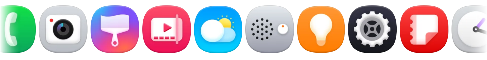
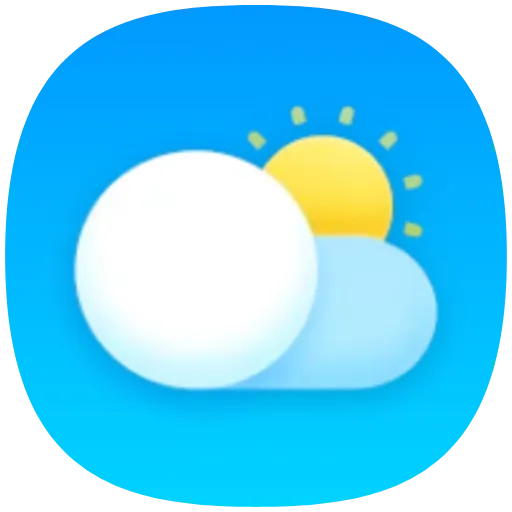
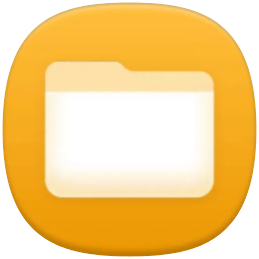
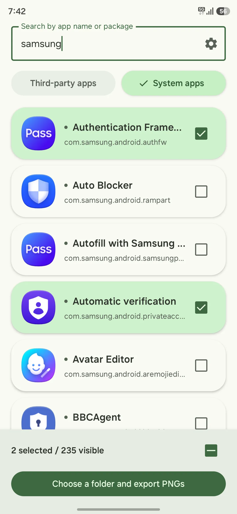
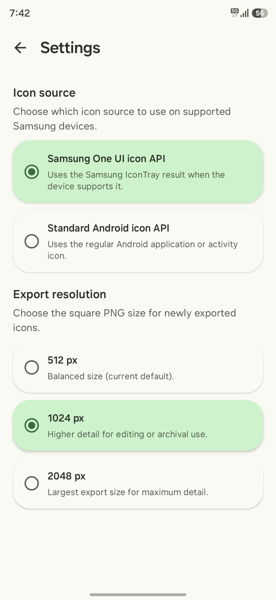

# One UI Icon Extractor - One UI アイコン抽出ツール

[English](../README.md) | [한국어](./README.ko.md) | **日本語** | [简体中文](./README.zh-Hans.md) | [繁體中文](./README.zh-Hant.md)

One UI 8.5から、すべてのアプリのアイコンに美しい3Dシャドウ効果が追加され、Samsungの標準アプリやシステムアプリのアイコンはこれを前提にデザインされています。 
しかし、ほとんどのアイコン抽出ツールではこの効果が含まれた状態のアイコンを取得できず、ユーザーが抽出して配布しているものや、各種Wikiなどに登録されているアイコンにも、残念ながらこの効果は反映されていません。

この効果を含んだ状態のアイコンを実際に取得するには、Samsungデバイス専用の非公開APIである `semGetApplicationIconForIconTray(...)` または `semGetActivityIconForIconTray(...)` を使用する必要があります。 
これらはOne UI Homeのリバースエンジニアリングを通じて発見されたもので、One UI Icon Extractorはこれを利用しています。（ただし、一部のアクティビティでは3D効果が適用されませんが、これはOne UIの仕様、もしくはバグだと思われます。）

このアプリはOne UIだけでなく他社のAndroid端末でも動作しますが、その場合はAndroidの標準APIを使用します。

## インストール
GitHubのReleasesページからダウンロードできます。 
**[▶ GitHub Releases ページへ移動](https://github.com/Palmoe/OneUI-Icon-Extractor/releases/latest)**

## 比較

| 標準のAndroid API | One UI Icon Extractor |
| :---: | :---: |
|  |  |
|  |  |

## スクリーンショット

|  |  |
| :---: | :---: |

## Pro Tips
自身のアプリに One UI Sans フォントを適用したい場合は、フォントファミリーの宣言で `sec` を `sans-serif` の前に指定してください。

## 免責事項
***本プロジェクトは独立したオープンソースプロジェクトであり、Samsung Electronics Co., Ltd. との提携、保証、およびいかなる関連性もありません。本ページに説明目的で使用されているアイコン、ロゴ、および商標のすべての権利は、原著作者であるSamsungに帰属します。***

## ライセンス
特に明記されていない限り、このリポジトリのソースコードは [Apache-2.0](../LICENSE) のもとで提供されます。 
アイコン、ロゴ、スクリーンショット、商標、その他のサードパーティの視覚アセットはこのライセンスの対象外です。詳細は [NOTICE](../NOTICE) をご覧ください。
